Bibliometric analysis of publications in Plains Anthropologist from
2001-2020
================
Robert Z. Selden, Jr.
20 May, 2021

## Bibliometrics

The dataset used in this analysis was harvested from
[Scopus](https://www.elsevier.com/solutions/scopus), includes all
articles published in *Plains Anthropologist* from 2001 - 2020, and was
analysed using the `bibliometrix` package (Aria and Cuccurullo 2017).

``` r
# install bibliometrix and load data
# devtools::install_github("massimoaria/bibliometrix")

# load
library(here)
```

    ## here() starts at D:/github/plainsbib

``` r
library(bibliometrix)
```

    ## To cite bibliometrix in publications, please use:
    ## 
    ## Aria, M. & Cuccurullo, C. (2017) bibliometrix: An R-tool for comprehensive science mapping analysis, 
    ##                                  Journal of Informetrics, 11(4), pp 959-975, Elsevier.
    ##                         
    ## 
    ## https://www.bibliometrix.org
    ## 
    ##                         
    ## For information and bug reports:
    ##                         - Send an email to info@bibliometrix.org   
    ##                         - Write a post on https://github.com/massimoaria/bibliometrix/issues
    ##                         
    ## Help us to keep Bibliometrix free to download and use by contributing with a small donation to support our research team (https://bibliometrix.org/donate.html)
    ## 
    ##                         
    ## To start with the shiny web-interface, please digit:
    ## biblioshiny()

``` r
library(reshape2)
library(ggplot2)

# data frame
df <- convert2df(file = "scopus.bib", 
                 dbsource = "scopus", 
                 format = "bibtex")
```

    ## 
    ## Converting your scopus collection into a bibliographic dataframe
    ## 
    ## 
    ## Warning:
    ## In your file, some mandatory metadata are missing. Bibliometrix functions may not work properly!
    ## 
    ## Please, take a look at the vignettes:
    ## - 'Data Importing and Converting' (https://www.bibliometrix.org/vignettes/Data-Importing-and-Converting.html)
    ## - 'A brief introduction to bibliometrix' (https://www.bibliometrix.org/vignettes/Introduction_to_bibliometrix.html)
    ## 
    ## 
    ## Missing fields:  ID 
    ## Done!
    ## 
    ## 
    ## Generating affiliation field tag AU_UN from C1:  Done!

## Descriptive analysis

``` r
results <- biblioAnalysis(df, 
                          sep = ";")
options(width = 100)
s <- summary(object = results, 
             k = 20, 
             pause = FALSE)
```

    ## 
    ## 
    ## MAIN INFORMATION ABOUT DATA
    ## 
    ##  Timespan                              2001 : 2020 
    ##  Sources (Journals, Books, etc)        1 
    ##  Documents                             424 
    ##  Average years from publication        11.1 
    ##  Average citations per documents       3.703 
    ##  Average citations per year per doc    0.2942 
    ##  References                            21029 
    ##  
    ## DOCUMENT TYPES                     
    ##  article               359 
    ##  conference paper      6 
    ##  editorial             26 
    ##  erratum               2 
    ##  letter                1 
    ##  note                  9 
    ##  review                21 
    ##  
    ## DOCUMENT CONTENTS
    ##  Keywords Plus (ID)                    0 
    ##  Author's Keywords (DE)                1035 
    ##  
    ## AUTHORS
    ##  Authors                               488 
    ##  Author Appearances                    754 
    ##  Authors of single-authored documents  185 
    ##  Authors of multi-authored documents   303 
    ##  
    ## AUTHORS COLLABORATION
    ##  Single-authored documents             241 
    ##  Documents per Author                  0.869 
    ##  Authors per Document                  1.15 
    ##  Co-Authors per Documents              1.78 
    ##  Collaboration Index                   1.66 
    ##  
    ## 
    ## Annual Scientific Production
    ## 
    ##  Year    Articles
    ##     2001       17
    ##     2002       24
    ##     2003       14
    ##     2004       13
    ##     2005       24
    ##     2006       51
    ##     2007       20
    ##     2008       32
    ##     2009       27
    ##     2010       24
    ##     2011       25
    ##     2012       22
    ##     2013        7
    ##     2014       16
    ##     2015       18
    ##     2016       24
    ##     2017       14
    ##     2018       18
    ##     2019       19
    ##     2020       15
    ## 
    ## Annual Percentage Growth Rate -0.6565884 
    ## 
    ## 
    ## Most Productive Authors
    ## 
    ##     Authors        Articles  Authors        Articles Fractionalized
    ## 1  KEYSER JD             14 KEYSER JD                          7.83
    ## 2  NICHOLSON BA          11 KORNFELD M                         7.53
    ## 3  KORNFELD M            10 HOWARD CD                          5.00
    ## 4  HOARD RJ               9 KRAUSE RA                          5.00
    ## 5  JOHNSON E              8 SEYMOUR DJ                         5.00
    ## 6  ROPER DC               8 ROPER DC                           4.95
    ## 7  HAMILTON S             7 NICHOLSON BA                       4.42
    ## 8  HUGHES RE              6 HOARD RJ                           4.26
    ## 9  KRAUSE RA              6 SMITH CS                           4.17
    ## 10 SMITH CS               6 BUEHLER KJ                         4.00
    ## 11 BILLECK WT             5 NA NA                              4.00
    ## 12 HOFMAN JL              5 JOHNSON E                          3.50
    ## 13 HOWARD CD              5 TRABERT S                          3.50
    ## 14 MEYER D                5 TURPIN SA                          3.50
    ## 15 MICHAEL QUIGG J        5 MICHAEL QUIGG J                    3.33
    ## 16 OETELAAR GA            5 ADAIR MJ                           3.00
    ## 17 SEYMOUR DJ             5 HILL JR. ME                        3.00
    ## 18 ADAIR MJ               4 OETELAAR GA                        3.00
    ## 19 BUEHLER KJ             4 BILLECK WT                         2.83
    ## 20 FINLEY JB              4 HOFMAN JL                          2.83
    ## 
    ## 
    ## Top manuscripts per citations
    ## 
    ##                                Paper                                     DOI TC TCperYear  NTC
    ## 1  SEYMOUR DJ, 2004, PLAINS ANTHROPOLOGIST    10.1179/pan.2004.013           39     2.167 4.53
    ## 2  HUNZICKER DA, 2008, PLAINS ANTHROPOLOGIST  10.1179/pan.2008.020           38     2.714 6.02
    ## 3  OWSLEY DW, 2001, PLAINS ANTHROPOLOGIST     10.1080/2052546.2001.11932062  35     1.667 3.74
    ## 4  BLACKMAR JM, 2001, PLAINS ANTHROPOLOGIST   10.1080/2052546.2001.11932058  35     1.667 3.74
    ## 5  THOMS AV, 2008, PLAINS ANTHROPOLOGIST      10.1179/pan.2008.008           25     1.786 3.96
    ## 6  BRINK JW, 2003, PLAINS ANTHROPOLOGIST      10.1080/2052546.2003.11949298  25     1.316 3.43
    ## 7  BUCHANAN B, 2007, PLAINS ANTHROPOLOGIST    10.1179/pan.2007.019           24     1.600 5.33
    ## 8  MORROW JE, 2002, PLAINS ANTHROPOLOGIST     10.1080/2052546.2002.11949250  23     1.150 2.92
    ## 9  HILL JR. ME, 2002, PLAINS ANTHROPOLOGIST   10.1080/2052546.2002.11949252  22     1.100 2.79
    ## 10 WHITTAKER JC, 2006, PLAINS ANTHROPOLOGIST  10.1179/pan.2006.016           20     1.250 6.85
    ## 11 SUNDSTROM L, 2002, PLAINS ANTHROPOLOGIST   10.1080/2052546.2002.11949234  20     1.000 2.54
    ## 12 JOHNSON AL, 2008, PLAINS ANTHROPOLOGIST    10.1179/pan.2008.009           19     1.357 3.01
    ## 13 HENRIKSON LS, 2003, PLAINS ANTHROPOLOGIST  10.1080/2052546.2003.11949267  18     0.947 2.47
    ## 14 HILL MG, 2005, PLAINS ANTHROPOLOGIST       10.1179/pan.2005.023           17     1.000 4.00
    ## 15 OETELAAR GA, 2006, PLAINS ANTHROPOLOGIST-a 10.1179/pan.2006.030           16     1.000 5.48
    ## 16 OETELAAR GA, 2014, PLAINS ANTHROPOL        10.1179/2052546X13Y.0000000004 15     1.875 5.33
    ## 17 SEYMOUR DJ, 2008, PLAINS ANTHROPOLOGIST    10.1179/pan.2008.017           15     1.071 2.38
    ## 18 BYERS DA, 2002, PLAINS ANTHROPOLOGIST      10.1080/2052546.2002.11949254  15     0.750 1.90
    ## 19 HOWARD CD, 2002, PLAINS ANTHROPOLOGIST     10.1080/2052546.2002.11932098  15     0.750 1.90
    ## 20 SEYMOUR DJ, 2010, PLAINS ANTHROPOLOGIST    10.1179/pan.2010.004           14     1.167 3.43
    ## 
    ## 
    ## Corresponding Author's Countries
    ## 
    ##          Country Articles    Freq SCP MCP MCP_Ratio
    ## 1 USA                 278 0.87421 271   7    0.0252
    ## 2 CANADA               37 0.11635  31   6    0.1622
    ## 3 FINLAND               1 0.00314   1   0    0.0000
    ## 4 JORDAN                1 0.00314   1   0    0.0000
    ## 5 UNITED KINGDOM        1 0.00314   0   1    1.0000
    ## 
    ## 
    ## SCP: Single Country Publications
    ## 
    ## MCP: Multiple Country Publications
    ## 
    ## 
    ## Total Citations per Country
    ## 
    ##     Country      Total Citations Average Article Citations
    ## 1 USA                       1237                      4.45
    ## 2 CANADA                     200                      5.41
    ## 3 UNITED KINGDOM              13                     13.00
    ## 4 JORDAN                       3                      3.00
    ## 5 FINLAND                      0                      0.00
    ## 
    ## 
    ## Most Relevant Sources
    ## 
    ##          Sources        Articles
    ## 1 PLAINS ANTHROPOLOGIST      424

``` r
# plot attributes
plot(x = results, 
     k = 20, 
     pause = FALSE)
```

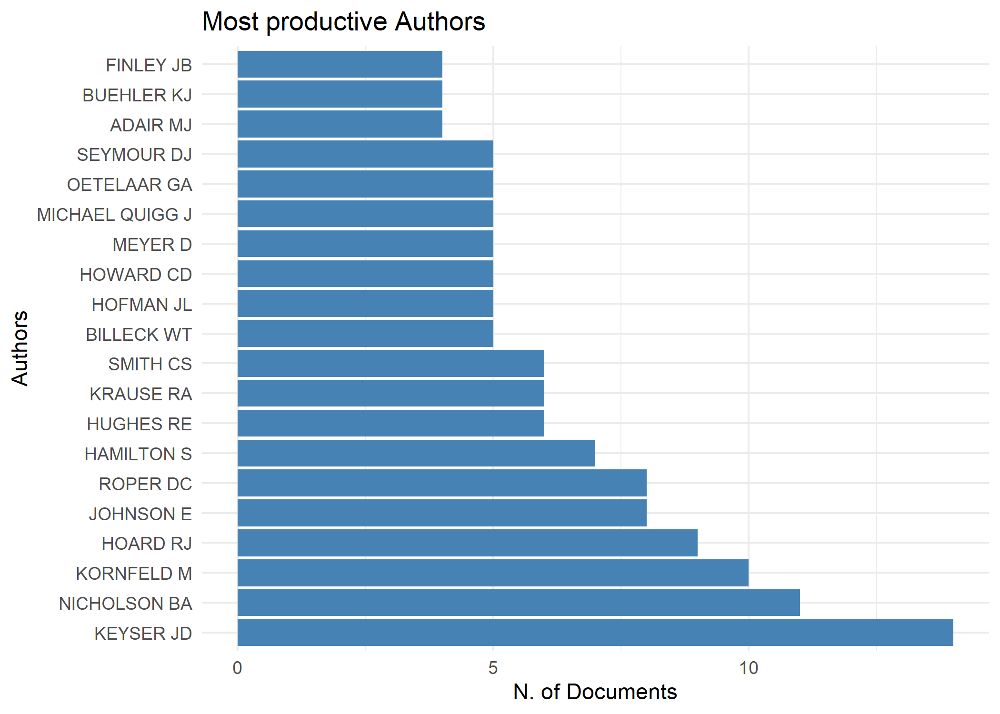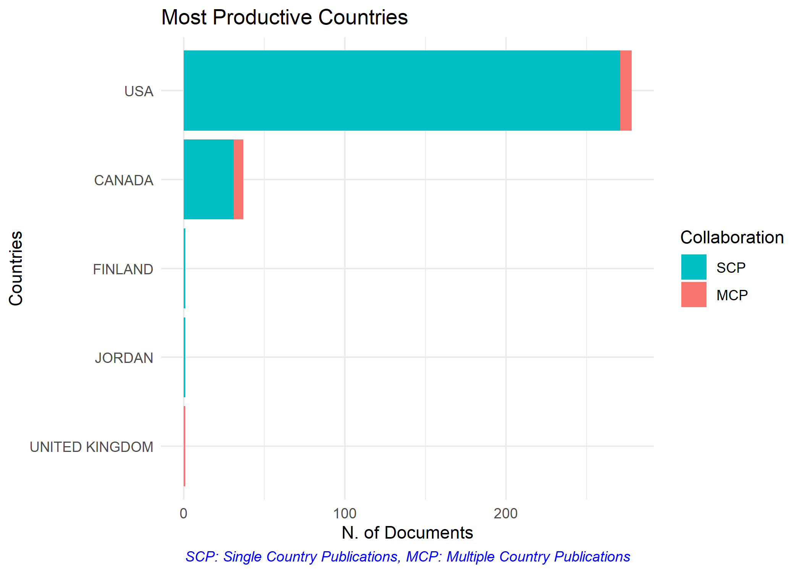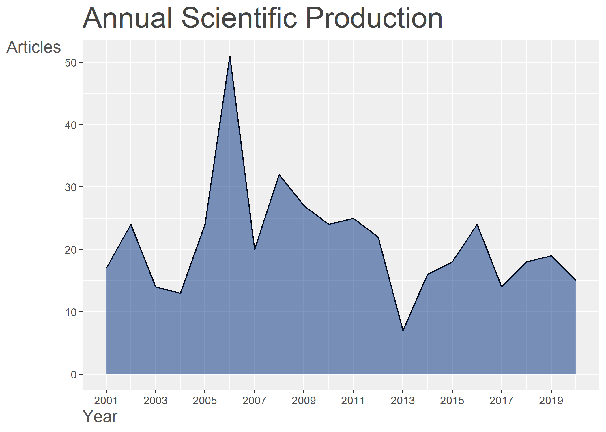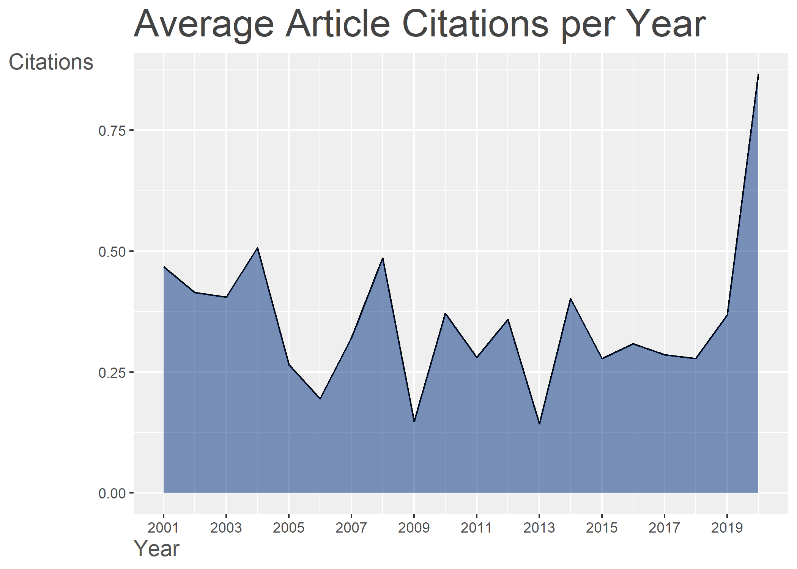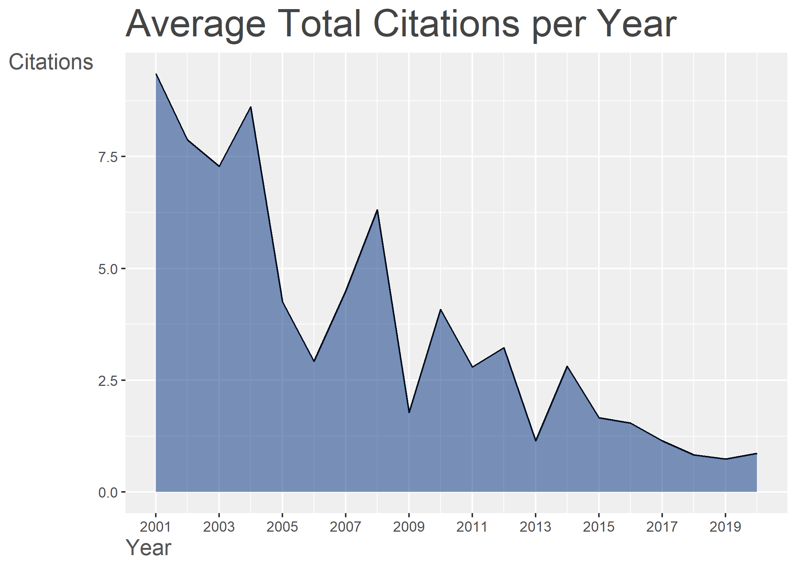

### Attributes of the local network

``` r
# calculate citations in local network
CR <- localCitations(df, sep = ";")

# top 20 cited authors in local network
CR$Authors[1:20,]
```

    ##             Author LocalCitations
    ## 234      KRAUSE RA             10
    ## 187       HOARD RJ              9
    ## 146    GLASCOCK MD              7
    ## 233     KORNFELD M              6
    ## 376       ROPER DC              6
    ## 403       SMITH CS              6
    ## 226      KEYSER JD              5
    ## 358 RAYMOND WOOD W              5
    ## 416  STURDEVANT JT              5
    ## 434      TRABERT S              5
    ## 27         BECK ME              4
    ## 83    CARPENTER SM              4
    ## 111    DICOSOLA AC              4
    ## 139      FRISON GC              4
    ## 173      HANNUS LA              4
    ## 211      JOHNSON E              4
    ## 238      KVAMME KL              4
    ## 410    SPEAKMAN RJ              4
    ## 470      WIEWEL AS              4
    ## 1         ADAIR MJ              3

``` r
# top 20 cited papers in local network
CR$Papers[1:20,]
```

    ##                                        Paper                            DOI Year LCS GCS
    ## 424 BLACKMAR JM, 2001, PLAINS ANTHROPOLOGIST  10.1080/2052546.2001.11932058 2001   6  35
    ## 402 SCHNEIDER F, 2002, PLAINS ANTHROPOLOGIST  10.1080/2052546.2002.11932106 2002   5  13
    ## 173  ROPER DC, 2011, PLAINS ANTHROPOLOGIST-a           10.1179/pan.2011.002 2011   4  10
    ## 362  SEYMOUR DJ, 2004, PLAINS ANTHROPOLOGIST           10.1179/pan.2004.013 2004   4  39
    ## 417     LOGAN B, 2001, PLAINS ANTHROPOLOGIST  10.1080/2052546.2001.11932057 2001   4   5
    ## 146  RICHARD AK, 2012, PLAINS ANTHROPOLOGIST           10.1179/pan.2012.013 2012   3   3
    ## 152  ROPER DC, 2012, PLAINS ANTHROPOLOGIST-a           10.1179/pan.2012.004 2012   3   6
    ## 176   WILSON MC, 2011, PLAINS ANTHROPOLOGIST           10.1179/pan.2011.003 2011   3   9
    ## 200     WOOD WR, 2010, PLAINS ANTHROPOLOGIST           10.1179/pan.2010.024 2010   3   5
    ## 231    BAUGH TG, 2008, PLAINS ANTHROPOLOGIST           10.1179/pan.2008.031 2008   3   6
    ## 237    LEITH EA, 2008, PLAINS ANTHROPOLOGIST           10.1179/pan.2008.038 2008   3   5
    ## 313 OETELAAR GA, 2006, PLAINS ANTHROPOLOGIST           10.1179/pan.2006.031 2006   3  12
    ## 369     TOOM DL, 2004, PLAINS ANTHROPOLOGIST           10.1179/pan.2004.019 2004   3   9
    ## 381    BRINK JW, 2003, PLAINS ANTHROPOLOGIST  10.1080/2052546.2003.11949298 2003   3  25
    ## 383     GREER M, 2003, PLAINS ANTHROPOLOGIST  10.1080/2052546.2003.11949299 2003   3   8
    ## 395 HILL JR. ME, 2002, PLAINS ANTHROPOLOGIST  10.1080/2052546.2002.11949252 2002   3  22
    ## 401   HOWARD CD, 2002, PLAINS ANTHROPOLOGIST  10.1080/2052546.2002.11932098 2002   3  15
    ## 68     YELLOW BIRD L, 2016, PLAINS ANTHROPOL  10.1080/00320447.2016.1245961 2016   2   2
    ## 72         KRAUSE RA, 2016, PLAINS ANTHROPOL  10.1080/00320447.2016.1245958 2016   2   3
    ## 113        FINLEY JB, 2014, PLAINS ANTHROPOL 10.1179/2052546X13Y.0000000006 2014   2   7

``` r
# top authors' productivity over time
topAU <- authorProdOverTime(df, 
                            k = 20, 
                            graph = TRUE)
```

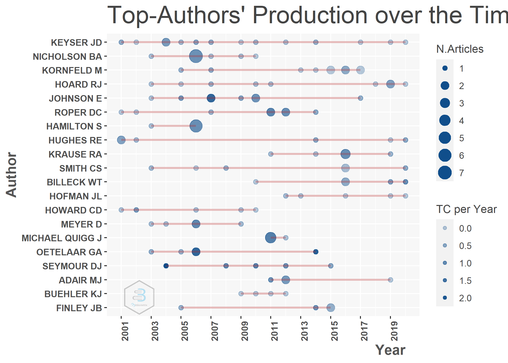

## Most cited

### Most cited articles

``` r
# most cited references in global network
mcr <- citations(df, 
                 field = "article", 
                 sep = ";")
cbind(mcr$Cited[1:20])
```

    ##                                                                                                                                                                                               [,1]
    ## BINFORD, L.R., (1978) NUNAMIUT ETHNOARCHAEOLOGY, , ACADEMIC PRESS, NEW YORK                                                                                                                     15
    ## FRISON, G.C., (1978) PREHISTORIC HUNTERS OF THE HIGH PLAINS, , ACADEMIC PRESS, NEW YORK                                                                                                         13
    ## KEYSER, J.D., KLASSEN, M.A., (2001) PLAINS INDIAN ROCK ART, , UNIVERSITY OF WASHINGTON PRESS, SEATTLE                                                                                           11
    ## LYMAN, R.L., (1994) VERTEBRATE TAPHONOMY, , CAMBRIDGE UNIVERSITY PRESS, CAMBRIDGE                                                                                                               11
    ## HOLLIDAY, V.T., (1997) PALEOINDIAN GEOARCHAEOLOGY OF THE SOUTHERN HIGH PLAINS, , UNIVERSITY OF TEXAS PRESS, AUSTIN                                                                              10
    ## FRISON, G.C., (1974) THE CASPER SITE: A HELL GAP BISON KILL ON THE HIGH PLAINS, , ACADEMIC PRESS, NEW YORK                                                                                       9
    ## KREUTZER, L.A., BISON AND DEER BONE MINERAL DENSITIES: COMPARISONS AND IMPLICATIONS FOR THE INTERPRETATION OF ARCHAEOLOGICAL FAUNAS (1992) JOURNAL OF ARCHAEOLOGICAL SCIENCE, 19, PP. 271-294    9
    ## BAMFORTH, D.B., (1988) ECOLOGY AND HUMAN ORGANIZATION ON THE GREAT PLAINS, , PLENUM PRESS, NEW YORK                                                                                              8
    ## BEMENT, L.C., (1999) BISON HUNTING AT COOPER SITE: WHERE LIGHTNING BOLTS DREW THUNDERING HERDS, , UNIVERSITY OF OKLAHOMA PRESS, NORMAN                                                           8
    ## BINFORD, L.R., (1981) BONES: ANCIENT MEN AND MODERN MYTHS, , ACADEMIC PRESS, NEW YORK                                                                                                            8
    ## BROWNSTONE, A., (1993) WAR PAINT: BLACKFOOT AND SARCEE PAINTED BUFFALO ROBES IN THE ROYAL ONTARIO MUSEUM, , ROYAL ONTARIO MUSEUM, TORONTO                                                        8
    ## FRISON, G.C., BRADLEY, B.A., (1980) FOLSOM TOOLS AND TECHNOLOGY AT THE HANSON SITE, WYOMING, , UNIVERSITY OF NEW MEXICO PRESS, ALBUQUERQUE                                                       8
    ## KEYSER, J.D., WRITING-ON-STONE: ROCK ART ON THE NORTHWESTERN PLAINS (1977) CANADIAN JOURNAL OF ARCHAEOLOGY, 1, PP. 15-80                                                                         8
    ## BINFORD, L.R., WILLOW SMOKE AND DOG'S TAILS: HUNTER-GATHERER SETTLEMENT SYSTEMS AND ARCHAEOLOGICAL SITE FORMATION (1980) AMERICAN ANTIQUITY, 45, PP. 4-20                                        7
    ## FRISON, G.C., (1991) PREHISTORIC HUNTERS OF THE HIGH PLAINS, , 2ND ED. ACADEMIC PRESS, SAN DIEGO                                                                                                 7
    ## KELLY, R.L., TODD, L.C., COMING INTO THE COUNTRY: EARLY PALEOINDIAN HUNTING AND MOBILITY (1988) AMERICAN ANTIQUITY, 53, PP. 231-244                                                              7
    ## LOBDELL, J.E., THE SCOGGIN SITE: AN EARLY MIDDLE PERIOD BISON KILL (1973) THE WYOMING ARCHAEOLOGIST, 16 (3), PP. 1-36                                                                            7
    ## PETERSEN, K.D., (1971) PLAINS INDIAN ART FROM FORT MARION, , UNIVERSITY OF OKLAHOMA PRESS, NORMAN                                                                                                7
    ## SPETH, J.D., (1983) BISON KILLS AND BONE COUNTS: DECISION MAKING BY ANCIENT HUNTERS, , UNIVERSITY OF CHICAGO PRESS, CHICAGO                                                                      7
    ## VEHIK, S.C., CONFLICT, TRADE, AND POLITICAL DEVELOPMENT ON THE SOUTHERN PLAINS (2002) AMERICAN ANTIQUITY, 67, PP. 37-64                                                                          7

### Most cited authors

``` r
# most cited authors in global network
mcr <- citations(df, 
                 field = "author", 
                 sep = ";")
cbind(mcr$Cited[1:20])
```

    ##               [,1]
    ## FRISON G C     411
    ## KEYSER J D     219
    ## WOOD W R       163
    ## HOFMAN J L     160
    ## WEDEL W R      133
    ## TODD L C       130
    ## HUGHES R E     128
    ## AHLER S A      119
    ## HOLLIDAY V T   116
    ## BINFORD L R    114
    ## KORNFELD M     108
    ## JOHNSON E      101
    ## LARSON M L     101
    ## NICHOLSON B A   91
    ## SMITH C S       85
    ## BENEDICT J B    84
    ## ROPER D C       80
    ## REEVES B O K    78
    ## BAMFORTH D B    77
    ## STANFORD D J    76

### Author dominance ranking

``` r
dom <- biblioAnalysis(df)
dom.r <- dominance(dom)
dom.r
```

    ##          Author Dominance Factor Tot Articles Single-Authored Multi-Authored First-Authored Rank by Articles Rank by DF
    ## 1      SMITH CS        1.0000000            6               3              3              3                7          1
    ## 2     KEYSER JD        0.8181818           14               3             11              9                1          2
    ## 3      ROPER DC        0.8000000            8               3              5              4                5          3
    ## 4     HOFMAN JL        0.7500000            5               1              4              3               10          4
    ## 5      HOARD RJ        0.7142857            9               2              7              5                4          5
    ## 6  NICHOLSON BA        0.6363636           11               0             11              7                2          6
    ## 7     KRAUSE RA        0.5000000            6               4              2              1                7          7
    ## 8    KORNFELD M        0.3333333           10               7              3              1                3          8
    ## 9     HUGHES RE        0.3333333            6               0              6              2                7          8
    ## 10   HAMILTON S        0.2857143            7               0              7              2                6         10

## Intellectual structure

### Author co-citation

Co-citation analysis is the most commonly used bibliometric analysis
method (Ding, Chowdhury, and Foo 2001), and is defined as two
publications that are cited together in one article (Small 1973).

``` r
# extract author names from reference items
df <- metaTagExtraction(df,
                        Field = "CR_AU")

# author co-citation network
auth.co.mat <- biblioNetwork(df, 
                             analysis = "co-citation", 
                             network = "authors", 
                             sep = ";")

# network plot
auth.co.net = networkPlot(auth.co.mat, 
                          n = 50, 
                          Title = "Author Co-Citation Network", 
                          type = "auto", 
                          size = 10, 
                          size.cex = T, 
                          remove.multiple = FALSE, 
                          labelsize = 0.5, 
                          edgesize = 8, 
                          edges.min = 3, 
                          remove.isolates = TRUE)
```

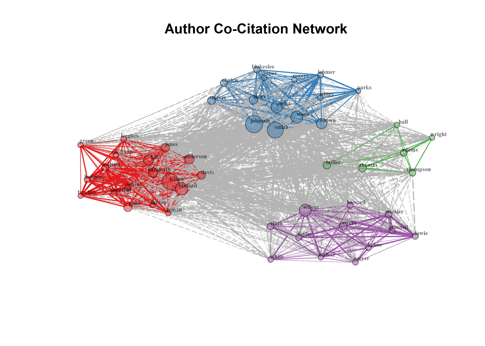

``` r
# descriptive analysis of author co-citation network
auth.co.netstat <- networkStat(auth.co.mat)
summary(auth.co.netstat, k = 15)
```

    ## 
    ## 
    ## Main statistics about the network
    ## 
    ##  Size                                  6082 
    ##  Density                               0.027 
    ##  Transitivity                          0.346 
    ##  Diameter                              4 
    ##  Degree Centralization                 0.466 
    ##  Average path length                   2.121 
    ## 

### Author coupling

Coupling is a similarity measure that uses citation analysis to
illustrate a similarity relationship between documents. Author coupling
occurs when two authors reference a common third author in their
bibliographies.

``` r
# author coupling network
auth.coup.mat <- biblioNetwork(df, 
                             analysis = "coupling", 
                             network = "authors", 
                             sep = ";")

# network plot
auth.coup.net = networkPlot(auth.coup.mat, 
                          n = 50, 
                          Title = "Author Coupling Network", 
                          type = "mds", 
                          size = 10, 
                          size.cex = T,
                          remove.multiple = FALSE, 
                          labelsize = 0.5, 
                          edgesize = 5, 
                          edges.min = 8, 
                          remove.isolates = TRUE)
```

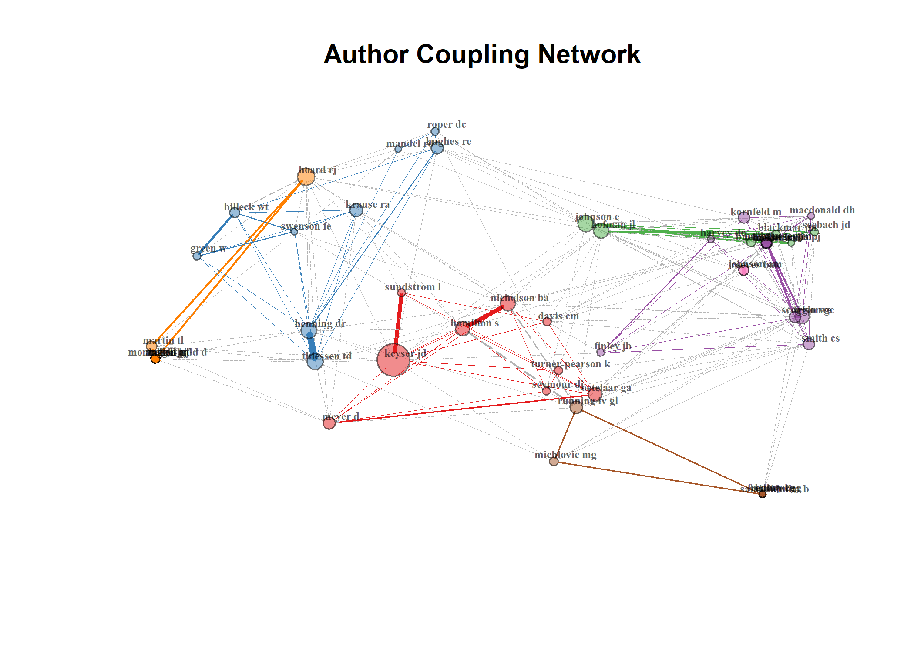

``` r
# descriptive analysis of author coupling network
auth.coup.netstat <- networkStat(auth.coup.mat)
summary(auth.coup.netstat, k = 15)
```

    ## 
    ## 
    ## Main statistics about the network
    ## 
    ##  Size                                  488 
    ##  Density                               0.162 
    ##  Transitivity                          0.49 
    ##  Diameter                              4 
    ##  Degree Centralization                 0.401 
    ##  Average path length                   1.923 
    ## 

## Historiograph direct citation linkages

The historiographic map is a chronological network map of the most
relevant direct citations resulting from this bibliographic collection.

``` r
# historical citation network
options(width = 100)
histResults <- histNetwork(df, 
                           min.citations = 25, 
                           sep = ";")
```

    ## 
    ## SCOPUS DB: Searching local citations (LCS) by document titles (TI) and DOIs...
    ## 
    ## Found 5 documents with no empty Local Citations (LCS)

``` r
# plot historical co-citation network
hnet <- histPlot(histResults, 
                 n = 100, 
                 size = 6, 
                 labelsize = 2)
```

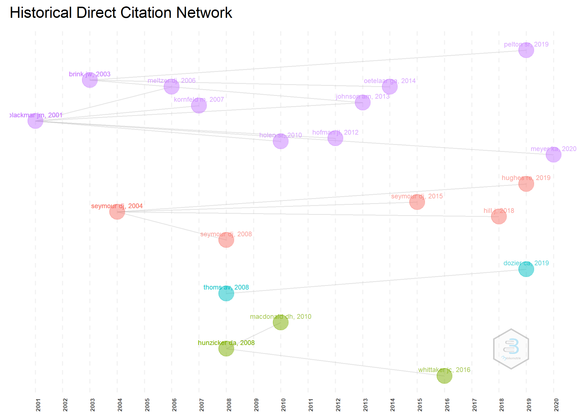

    ## 
    ##  Legend
    ## 
    ##                                        Label                            DOI Year LCS GCS
    ## 1  HUNZICKER DA, 2008, PLAINS ANTHROPOLOGIST           10.1179/pan.2008.020 2008   2  38
    ## 2      THOMS AV, 2008, PLAINS ANTHROPOLOGIST           10.1179/pan.2008.008 2008   1  25
    ## 3    SEYMOUR DJ, 2004, PLAINS ANTHROPOLOGIST           10.1179/pan.2004.013 2004   4  39
    ## 4      BRINK JW, 2003, PLAINS ANTHROPOLOGIST  10.1080/2052546.2003.11949298 2003   3  25
    ## 5   BLACKMAR JM, 2001, PLAINS ANTHROPOLOGIST  10.1080/2052546.2001.11932058 2001   6  35
    ## 6       WHITTAKER JC, 2016, PLAINS ANTHROPOL  10.1080/00320447.2015.1138032 2016   0   1
    ## 7  MACDONALD DH, 2010, PLAINS ANTHROPOLOGIST           10.1179/pan.2010.011 2010   0   7
    ## 8          DOZIER CA, 2019, PLAINS ANTHROPOL  10.1080/00320447.2018.1502963 2019   0   2
    ## 9          HUGHES RE, 2019, PLAINS ANTHROPOL  10.1080/00320447.2018.1544746 2019   0   0
    ## 10            HILL J, 2018, PLAINS ANTHROPOL  10.1080/00320447.2018.1435606 2018   0   5
    ## 11        SEYMOUR DJ, 2015, PLAINS ANTHROPOL 10.1179/2052546X13Y.0000000005 2015   0   4
    ## 12   SEYMOUR DJ, 2008, PLAINS ANTHROPOLOGIST           10.1179/pan.2008.017 2008   0  15
    ## 13         PELTON SR, 2019, PLAINS ANTHROPOL  10.1080/00320447.2018.1464369 2019   0   0
    ## 14       OETELAAR GA, 2014, PLAINS ANTHROPOL 10.1179/2052546X13Y.0000000004 2014   0  15
    ## 15        JOHNSON AM, 2013, PLAINS ANTHROPOL 10.1080/00320447.2013.11735767 2013   0   3
    ## 16          MEYER KA, 2020, PLAINS ANTHROPOL  10.1080/00320447.2019.1680786 2020   0   1
    ## 17    HOFMAN JL, 2012, PLAINS ANTHROPOLOGIST           10.1179/pan.2012.027 2012   0   2
    ## 18     HOLEN SR, 2010, PLAINS ANTHROPOLOGIST           10.1179/pan.2010.027 2010   0  11
    ## 19   KORNFELD M, 2007, PLAINS ANTHROPOLOGIST           10.1179/pan.2007.018 2007   0   7
    ## 20   MELTZER DJ, 2006, PLAINS ANTHROPOLOGIST           10.1179/pan.2006.012 2006   0  13

### Yearly occurrences of top keywords/terms

#### Authors’ keywords

``` r
topKW = KeywordGrowth(df, 
                      Tag = "DE", 
                      sep = ";", 
                      top = 10, 
                      cdf = TRUE)

topKW
```

    ##    Year PALEOINDIAN ROCK ART CENTRAL PLAINS TRADITION CERAMICS NORTHERN PLAINS BISON
    ## 1  2001           0        1                        1        0               0     1
    ## 2  2002           4        2                        2        0               0     2
    ## 3  2003           6        3                        2        0               1     3
    ## 4  2004           7        6                        2        0               3     3
    ## 5  2005           9        9                        2        2               3     6
    ## 6  2006          12       10                        2        2               7     7
    ## 7  2007          14       11                        4        4               7     7
    ## 8  2008          14       11                        4        4               7     8
    ## 9  2009          14       13                        6        6               7     9
    ## 10 2010          17       14                        7        6               9    10
    ## 11 2011          18       14                        8        8               9    10
    ## 12 2012          21       15                       10        8               9    10
    ## 13 2013          21       15                       10        8               9    10
    ## 14 2014          22       17                       10       10              10    10
    ## 15 2015          24       17                       10       10              10    10
    ## 16 2016          25       17                       10       10              10    10
    ## 17 2017          25       17                       10       10              10    11
    ## 18 2018          26       19                       11       11              10    11
    ## 19 2019          27       20                       11       11              11    11
    ## 20 2020          29       20                       12       12              12    11
    ##    SOUTHERN PLAINS CENTRAL PLAINS FOLSOM WYOMING
    ## 1                1              1      0       0
    ## 2                2              2      1       0
    ## 3                2              2      1       0
    ## 4                2              3      1       0
    ## 5                3              3      2       0
    ## 6                3              3      3       0
    ## 7                4              3      3       1
    ## 8                6              3      4       1
    ## 9                6              4      4       1
    ## 10               6              4      5       1
    ## 11               6              5      5       1
    ## 12               8              5      7       1
    ## 13               8              5      7       1
    ## 14               8              6      8       2
    ## 15               9              6      9       2
    ## 16               9              8     10       4
    ## 17               9              8     10       5
    ## 18               9              8     10       7
    ## 19              10              9     10       9
    ## 20              11             10     10      10

``` r
# plot results
key.plot = melt(topKW, 
                id ='Year')

ggplot(key.plot, aes(Year, 
                     value, 
                     group = variable, 
                     color = variable)) + 
  geom_line()
```

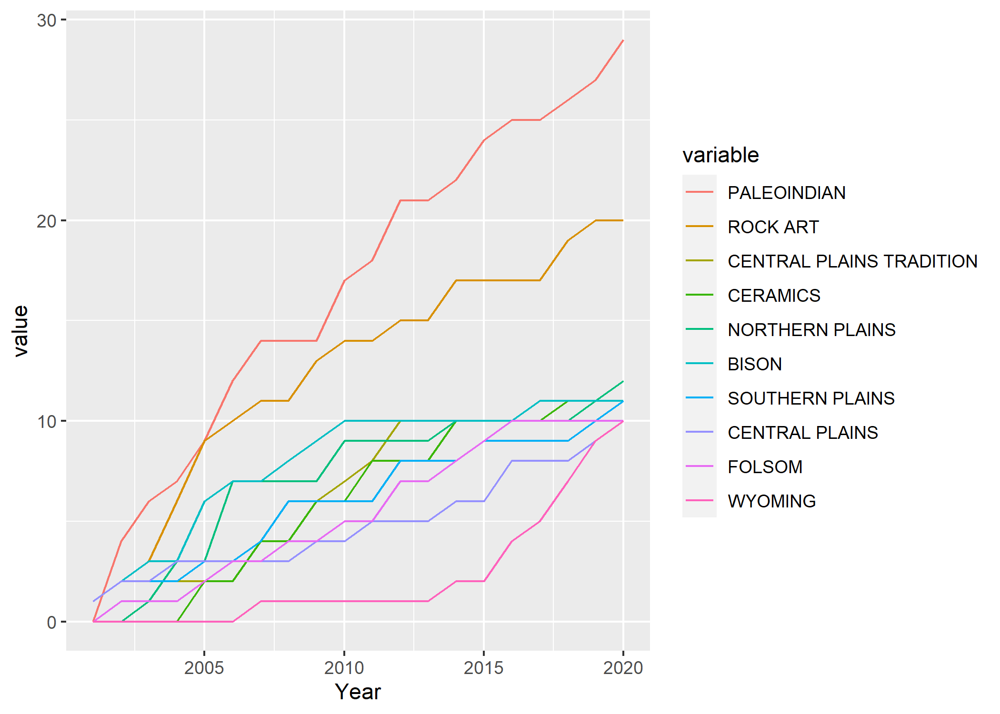

## Conceptual structure

### Co-word analysis

The co-word analysis maps the conceptual structure of a research domain
using the co-occurrence of author keywords in the bibliographic
collection.

#### Authors’ keywords

``` r
# using authors keywords
cw <- conceptualStructure(df, 
                          field = "DE", 
                          method = "MDS", 
                          minDegree = 2, 
                          clust = "auto", 
                          stemming = FALSE, 
                          labelsize = 10, 
                          documents = 50)
```

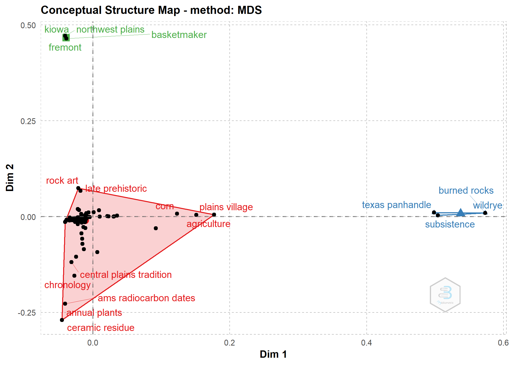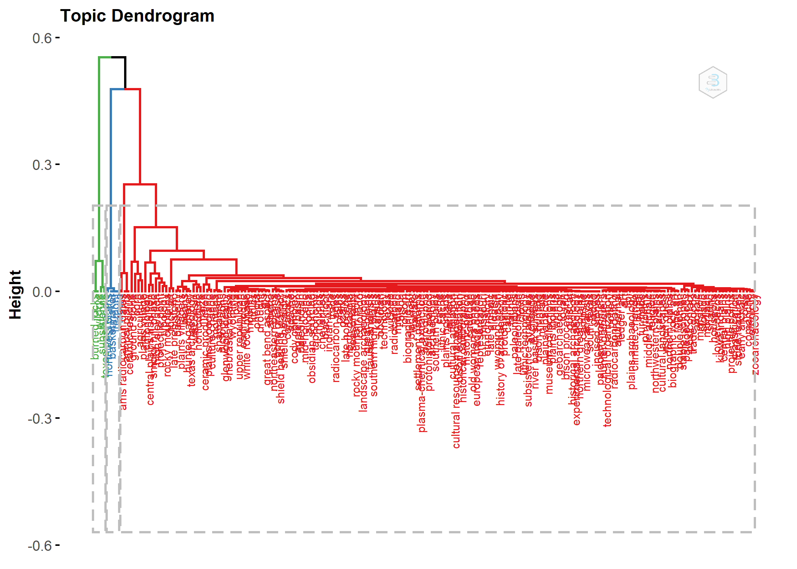

## Thematic mapping

From (Cobo et al. 2011, 150–51):

-   Themes in the upper-right quadrant are both well developed and
    important for the structuring ofa research field. They are known as
    the motor-themes of the specialty, given that they present strong
    centrality and high density. The placement of themesin this
    quadrantimplies that theyare related externally to concepts
    applicable to otherthemesthat are conceptually closely related.
-   Themes in the upper-left quadrant have well developed internal ties
    but unimportant external ties and so are of only marginal importance
    for the field. These themes are very specialized and peripheral in
    character.
-   Themes in the lower-left quadrant are both weakly developed and
    marginal. The themes ofthis quadrant have low density and low
    centrality, mainly representing either emerging or disappearing
    themes.
-   Themes in the lower-right quadrant are important for a research
    field but are not developed. So, this quadrant groups transversal
    and general, basic themes.

### Authors’ keywords

``` r
# keyword map
map1 = thematicMap(df, 
                   field = "DE", 
                   n = 1000, 
                   minfreq = 3, 
                   stemming = FALSE, 
                   size = 0.8, 
                   n.labels = 1, 
                   repel = TRUE)

# plot map
plot(map1$map)
```

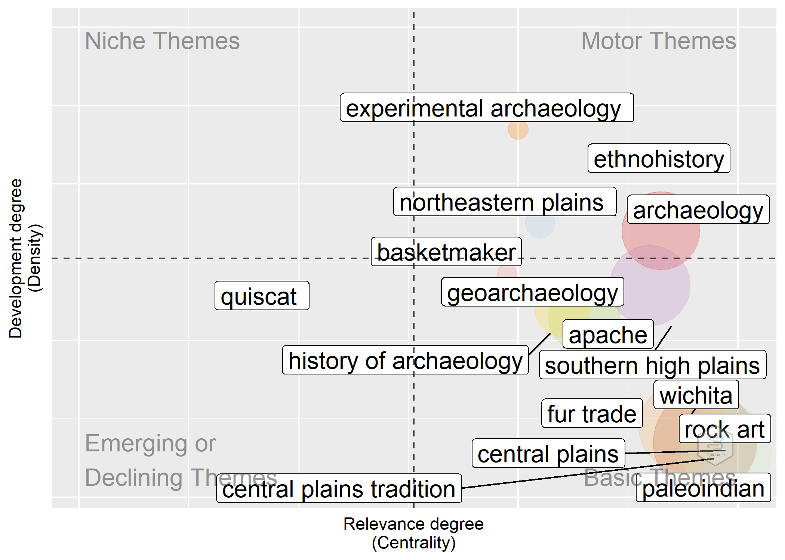

## Social structure

### Author collaboration

Scientific collaborations are plotted where nodes are authors and links
are co-authorships, illustrating collaborations between authors.

``` r
# author collaboration network
auth.collab <- biblioNetwork(df, 
                             analysis = "collaboration", 
                             network = "authors", 
                             sep = ";")

# network plot
auth.collabnet = networkPlot(auth.collab, 
                             n = 100, 
                             Title = "Author Collaboration", 
                             type = "mds", 
                             size = 20, 
                             size.cex = T,
                             edgesize = 2, 
                             labelsize = 0.5,
                             remove.multiple = TRUE,
                             remove.isolates = TRUE)
```

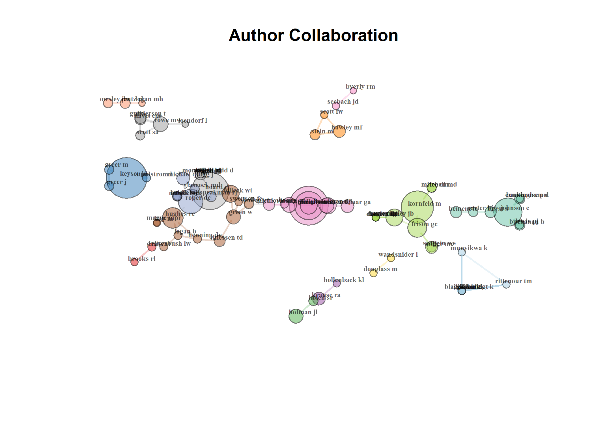

``` r
# descriptive analysis of author collaboration network
auth.collab.netstat <- networkStat(auth.collab)
summary(auth.collab.netstat, k = 15)
```

    ## 
    ## 
    ## Main statistics about the network
    ## 
    ##  Size                                  488 
    ##  Density                               0.004 
    ##  Transitivity                          0.612 
    ##  Diameter                              12 
    ##  Degree Centralization                 0.037 
    ##  Average path length                   4.051 
    ## 

### Edu collaboration

Scientific collaborations are plotted where nodes are institutions and
links are co-authorships, illustrating collaborations between
institutions.

``` r
# author collaboration network
edu.collab <- biblioNetwork(df, 
                            analysis = "collaboration", 
                            network = "universities",
                            sep = ";")

# network plot
edu.collabnet = networkPlot(edu.collab, 
                            n = 100, 
                            Title = "Edu Collaboration", 
                            type = "auto", 
                            size = 30, 
                            size.cex = T, 
                            edgesize = 2, 
                            labelsize = 0.4, 
                            remove.isolates = TRUE)
```

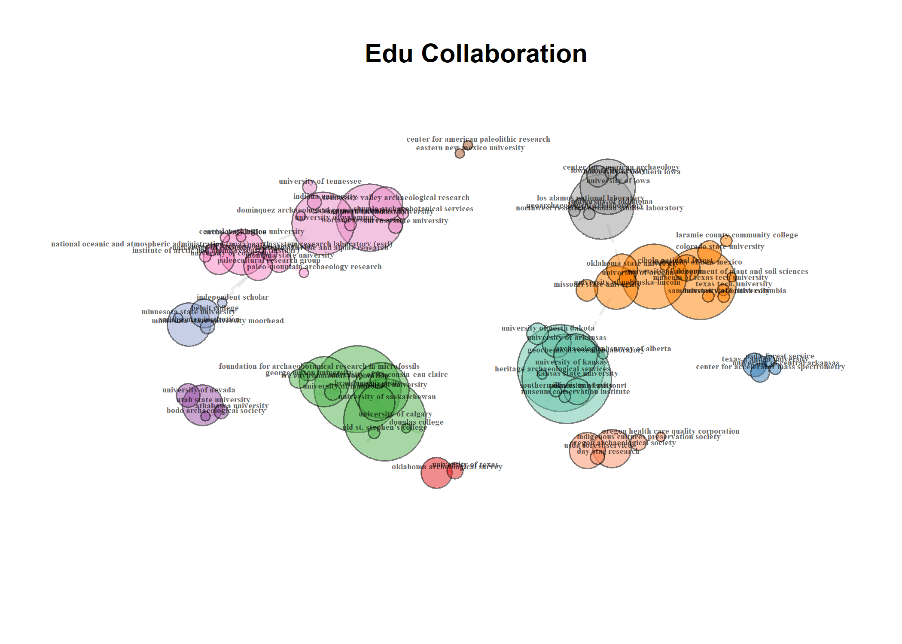

``` r
# descriptive analysis of edu collaboration network
edu.collab.netstat<-networkStat(edu.collab)
summary(edu.collab.netstat, k = 15)
```

    ## 
    ## 
    ## Main statistics about the network
    ## 
    ##  Size                                  233 
    ##  Density                               0.007 
    ##  Transitivity                          0.383 
    ##  Diameter                              7 
    ##  Degree Centralization                 0.036 
    ##  Average path length                   3.58 
    ## 

### Country collaboration

``` r
# country collaboration network
count <- metaTagExtraction(df, 
                           Field = "AU_CO", 
                           sep = ";")

cmat1 <- biblioNetwork(count, 
                       analysis = "collaboration", 
                       network = "countries", 
                       sep = ";")

# network plot
cnet1 = networkPlot(cmat1, 
                    n = dim(cmat1)[1], 
                    Title = "Country Collaboration", 
                    type = "circle", 
                    size = 10, 
                    size.cex = T, 
                    edgesize = 1, 
                    labelsize = 0.6, 
                    cluster = "none")
```

<div class="figure">

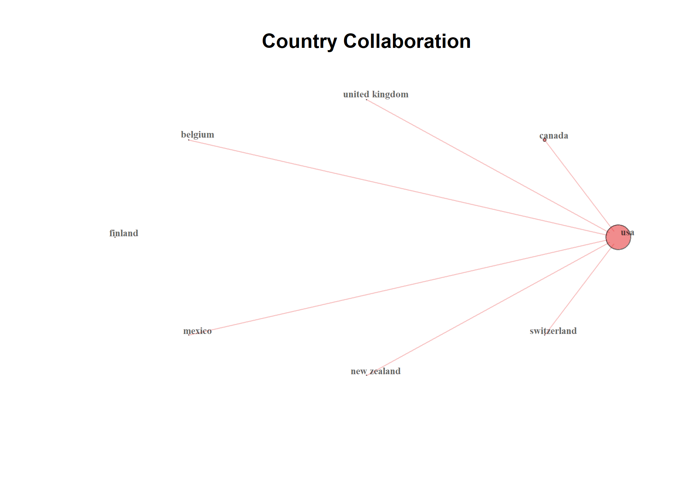
<p class="caption">
In this figure, scientific collaborations are plotted where nodes are
countries and links are co-authorships, illustrating collaborations
between countries
</p>

</div>

``` r
# descriptive analysis of country collaboration network
countnetstat <- networkStat(cmat1)
summary(countnetstat, k = 15)
```

    ## 
    ## 
    ## Main statistics about the network
    ## 
    ##  Size                                  8 
    ##  Density                               0.214 
    ##  Transitivity                          0 
    ##  Diameter                              2 
    ##  Degree Centralization                 0.643 
    ##  Average path length                   1.714 
    ## 

## Colophon

This version of the analysis was generated on 2021-05-20 09:06:15 using
the following computational environment and dependencies:

``` r
# what R packages and versions were used?
if ("devtools" %in% installed.packages()) devtools::session_info()
```

    ## - Session info -----------------------------------------------------------------------------------
    ##  setting  value                       
    ##  version  R version 4.0.5 (2021-03-31)
    ##  os       Windows 10 x64              
    ##  system   x86_64, mingw32             
    ##  ui       RTerm                       
    ##  language (EN)                        
    ##  collate  English_United States.1252  
    ##  ctype    English_United States.1252  
    ##  tz       America/Chicago             
    ##  date     2021-05-20                  
    ## 
    ## - Packages ---------------------------------------------------------------------------------------
    ##  package          * version  date       lib source                                   
    ##  abind              1.4-5    2016-07-21 [1] CRAN (R 4.0.0)                           
    ##  assertthat         0.2.1    2019-03-21 [1] CRAN (R 4.0.2)                           
    ##  backports          1.2.1    2020-12-09 [1] CRAN (R 4.0.3)                           
    ##  bibliometrix     * 3.1.1    2021-05-20 [1] Github (massimoaria/bibliometrix@2a7b6b8)
    ##  bibliometrixData   0.1.0    2020-12-10 [1] CRAN (R 4.0.3)                           
    ##  broom              0.7.6    2021-04-05 [1] CRAN (R 4.0.4)                           
    ##  cachem             1.0.4    2021-02-13 [1] CRAN (R 4.0.4)                           
    ##  callr              3.7.0    2021-04-20 [1] CRAN (R 4.0.4)                           
    ##  car                3.0-10   2020-09-29 [1] CRAN (R 4.0.3)                           
    ##  carData            3.0-4    2020-05-22 [1] CRAN (R 4.0.0)                           
    ##  cellranger         1.1.0    2016-07-27 [1] CRAN (R 4.0.2)                           
    ##  cli                2.5.0    2021-04-26 [1] CRAN (R 4.0.5)                           
    ##  cluster            2.1.1    2021-02-14 [2] CRAN (R 4.0.5)                           
    ##  colorspace         2.0-1    2021-05-04 [1] CRAN (R 4.0.5)                           
    ##  crayon             1.4.1    2021-02-08 [1] CRAN (R 4.0.3)                           
    ##  curl               4.3.1    2021-04-30 [1] CRAN (R 4.0.5)                           
    ##  data.table         1.14.0   2021-02-21 [1] CRAN (R 4.0.4)                           
    ##  DBI                1.1.1    2021-01-15 [1] CRAN (R 4.0.3)                           
    ##  dendextend         1.15.1   2021-05-08 [1] CRAN (R 4.0.5)                           
    ##  desc               1.3.0    2021-03-05 [1] CRAN (R 4.0.4)                           
    ##  devtools           2.4.1    2021-05-05 [1] CRAN (R 4.0.5)                           
    ##  digest             0.6.27   2020-10-24 [1] CRAN (R 4.0.3)                           
    ##  dimensionsR        0.0.2    2020-08-28 [1] CRAN (R 4.0.3)                           
    ##  dplyr              1.0.6    2021-05-05 [1] CRAN (R 4.0.5)                           
    ##  DT                 0.18     2021-04-14 [1] CRAN (R 4.0.4)                           
    ##  ellipsis           0.3.2    2021-04-29 [1] CRAN (R 4.0.5)                           
    ##  evaluate           0.14     2019-05-28 [1] CRAN (R 4.0.2)                           
    ##  factoextra         1.0.7    2020-04-01 [1] CRAN (R 4.0.3)                           
    ##  FactoMineR         2.4      2020-12-11 [1] CRAN (R 4.0.3)                           
    ##  fansi              0.4.2    2021-01-15 [1] CRAN (R 4.0.3)                           
    ##  farver             2.1.0    2021-02-28 [1] CRAN (R 4.0.4)                           
    ##  fastmap            1.1.0    2021-01-25 [1] CRAN (R 4.0.3)                           
    ##  flashClust         1.01-2   2012-08-21 [1] CRAN (R 4.0.3)                           
    ##  forcats            0.5.1    2021-01-27 [1] CRAN (R 4.0.3)                           
    ##  foreign            0.8-81   2020-12-22 [2] CRAN (R 4.0.5)                           
    ##  fs                 1.5.0    2020-07-31 [1] CRAN (R 4.0.2)                           
    ##  generics           0.1.0    2020-10-31 [1] CRAN (R 4.0.3)                           
    ##  ggnetwork          0.5.8    2020-02-12 [1] CRAN (R 4.0.5)                           
    ##  ggplot2          * 3.3.3    2020-12-30 [1] CRAN (R 4.0.3)                           
    ##  ggpubr             0.4.0    2020-06-27 [1] CRAN (R 4.0.2)                           
    ##  ggrepel            0.9.1    2021-01-15 [1] CRAN (R 4.0.3)                           
    ##  ggsignif           0.6.1    2021-02-23 [1] CRAN (R 4.0.4)                           
    ##  glue               1.4.2    2020-08-27 [1] CRAN (R 4.0.2)                           
    ##  gridExtra          2.3      2017-09-09 [1] CRAN (R 4.0.2)                           
    ##  gtable             0.3.0    2019-03-25 [1] CRAN (R 4.0.2)                           
    ##  haven              2.4.1    2021-04-23 [1] CRAN (R 4.0.5)                           
    ##  here             * 1.0.1    2020-12-13 [1] CRAN (R 4.0.3)                           
    ##  highr              0.9      2021-04-16 [1] CRAN (R 4.0.4)                           
    ##  hms                1.1.0    2021-05-17 [1] CRAN (R 4.0.5)                           
    ##  htmltools          0.5.1.1  2021-01-22 [1] CRAN (R 4.0.3)                           
    ##  htmlwidgets        1.5.3    2020-12-10 [1] CRAN (R 4.0.3)                           
    ##  httpuv             1.6.1    2021-05-07 [1] CRAN (R 4.0.5)                           
    ##  httr               1.4.2    2020-07-20 [1] CRAN (R 4.0.2)                           
    ##  igraph             1.2.6    2020-10-06 [1] CRAN (R 4.0.3)                           
    ##  janeaustenr        0.1.5    2017-06-10 [1] CRAN (R 4.0.5)                           
    ##  jsonlite           1.7.2    2020-12-09 [1] CRAN (R 4.0.3)                           
    ##  knitr              1.33     2021-04-24 [1] CRAN (R 4.0.5)                           
    ##  labeling           0.4.2    2020-10-20 [1] CRAN (R 4.0.3)                           
    ##  later              1.2.0    2021-04-23 [1] CRAN (R 4.0.5)                           
    ##  lattice            0.20-41  2020-04-02 [2] CRAN (R 4.0.5)                           
    ##  lazyeval           0.2.2    2019-03-15 [1] CRAN (R 4.0.2)                           
    ##  leaps              3.1      2020-01-16 [1] CRAN (R 4.0.3)                           
    ##  lifecycle          1.0.0    2021-02-15 [1] CRAN (R 4.0.4)                           
    ##  magrittr           2.0.1    2020-11-17 [1] CRAN (R 4.0.3)                           
    ##  MASS               7.3-54   2021-05-03 [1] CRAN (R 4.0.5)                           
    ##  Matrix             1.3-3    2021-05-04 [1] CRAN (R 4.0.5)                           
    ##  memoise            2.0.0    2021-01-26 [1] CRAN (R 4.0.3)                           
    ##  mime               0.10     2021-02-13 [1] CRAN (R 4.0.4)                           
    ##  munsell            0.5.0    2018-06-12 [1] CRAN (R 4.0.2)                           
    ##  openxlsx           4.2.3    2020-10-27 [1] CRAN (R 4.0.3)                           
    ##  pillar             1.6.1    2021-05-16 [1] CRAN (R 4.0.5)                           
    ##  pkgbuild           1.2.0    2020-12-15 [1] CRAN (R 4.0.3)                           
    ##  pkgconfig          2.0.3    2019-09-22 [1] CRAN (R 4.0.2)                           
    ##  pkgload            1.2.1    2021-04-06 [1] CRAN (R 4.0.5)                           
    ##  plotly             4.9.3    2021-01-10 [1] CRAN (R 4.0.3)                           
    ##  plyr               1.8.6    2020-03-03 [1] CRAN (R 4.0.2)                           
    ##  prettyunits        1.1.1    2020-01-24 [1] CRAN (R 4.0.2)                           
    ##  processx           3.5.2    2021-04-30 [1] CRAN (R 4.0.5)                           
    ##  promises           1.2.0.1  2021-02-11 [1] CRAN (R 4.0.3)                           
    ##  ps                 1.6.0    2021-02-28 [1] CRAN (R 4.0.4)                           
    ##  pubmedR            0.0.3    2020-07-09 [1] CRAN (R 4.0.3)                           
    ##  purrr              0.3.4    2020-04-17 [1] CRAN (R 4.0.2)                           
    ##  R6                 2.5.0    2020-10-28 [1] CRAN (R 4.0.3)                           
    ##  RColorBrewer       1.1-2    2014-12-07 [1] CRAN (R 4.0.0)                           
    ##  Rcpp               1.0.6    2021-01-15 [1] CRAN (R 4.0.3)                           
    ##  readr              1.4.0    2020-10-05 [1] CRAN (R 4.0.3)                           
    ##  readxl             1.3.1    2019-03-13 [1] CRAN (R 4.0.2)                           
    ##  remotes            2.3.0    2021-04-01 [1] CRAN (R 4.0.5)                           
    ##  rentrez            1.2.3    2020-11-10 [1] CRAN (R 4.0.3)                           
    ##  reshape2         * 1.4.4    2020-04-09 [1] CRAN (R 4.0.3)                           
    ##  rio                0.5.26   2021-03-01 [1] CRAN (R 4.0.4)                           
    ##  rlang              0.4.11   2021-04-30 [1] CRAN (R 4.0.5)                           
    ##  rmarkdown          2.8      2021-05-07 [1] CRAN (R 4.0.5)                           
    ##  rprojroot          2.0.2    2020-11-15 [1] CRAN (R 4.0.3)                           
    ##  rscopus            0.6.6    2019-09-17 [1] CRAN (R 4.0.3)                           
    ##  rstatix            0.7.0    2021-02-13 [1] CRAN (R 4.0.4)                           
    ##  scales             1.1.1    2020-05-11 [1] CRAN (R 4.0.2)                           
    ##  scatterplot3d      0.3-41   2018-03-14 [1] CRAN (R 4.0.3)                           
    ##  sessioninfo        1.1.1    2018-11-05 [1] CRAN (R 4.0.2)                           
    ##  shiny              1.6.0    2021-01-25 [1] CRAN (R 4.0.3)                           
    ##  SnowballC          0.7.0    2020-04-01 [1] CRAN (R 4.0.3)                           
    ##  stringdist         0.9.6.3  2020-10-09 [1] CRAN (R 4.0.3)                           
    ##  stringi            1.6.2    2021-05-17 [1] CRAN (R 4.0.5)                           
    ##  stringr            1.4.0    2019-02-10 [1] CRAN (R 4.0.2)                           
    ##  testthat           3.0.2    2021-02-14 [1] CRAN (R 4.0.4)                           
    ##  tibble             3.1.2    2021-05-16 [1] CRAN (R 4.0.5)                           
    ##  tidyr              1.1.3    2021-03-03 [1] CRAN (R 4.0.4)                           
    ##  tidyselect         1.1.1    2021-04-30 [1] CRAN (R 4.0.5)                           
    ##  tidytext           0.3.1    2021-04-10 [1] CRAN (R 4.0.5)                           
    ##  tokenizers         0.2.1    2018-03-29 [1] CRAN (R 4.0.5)                           
    ##  usethis            2.0.1    2021-02-10 [1] CRAN (R 4.0.3)                           
    ##  utf8               1.2.1    2021-03-12 [1] CRAN (R 4.0.4)                           
    ##  vctrs              0.3.8    2021-04-29 [1] CRAN (R 4.0.5)                           
    ##  viridis            0.6.1    2021-05-11 [1] CRAN (R 4.0.5)                           
    ##  viridisLite        0.4.0    2021-04-13 [1] CRAN (R 4.0.5)                           
    ##  withr              2.4.2    2021-04-18 [1] CRAN (R 4.0.4)                           
    ##  xfun               0.22     2021-03-11 [1] CRAN (R 4.0.4)                           
    ##  XML                3.99-0.6 2021-03-16 [1] CRAN (R 4.0.4)                           
    ##  xtable             1.8-4    2019-04-21 [1] CRAN (R 4.0.2)                           
    ##  yaml               2.2.1    2020-02-01 [1] CRAN (R 4.0.0)                           
    ##  zip                2.1.1    2020-08-27 [1] CRAN (R 4.0.2)                           
    ## 
    ## [1] C:/Users/seldenjrz/Documents/R/win-library/4.0
    ## [2] C:/Program Files/R/R-4.0.5/library

Current Git commit details are:

``` r
# where can I find this commit? 
if ("git2r" %in% installed.packages() & git2r::in_repository(path = ".")) git2r::repository(here::here())  
```

    ## Local:    main D:/github/plainsbib
    ## Remote:   main @ origin (https://github.com/aksel-blaise/plainsbib)
    ## Head:     [f0f9e5d] 2021-05-20: Initial commit

## References cited

<div id="refs" class="references csl-bib-body hanging-indent">

<div id="ref-RN20997" class="csl-entry">

Aria, Massimo, and Corrado Cuccurullo. 2017. “Bibliometrix : An r-Tool
for Comprehensive Science Mapping Analysis.” *Journal of Informetrics*
11 (4): 959–75. <https://doi.org/10.1016/j.joi.2017.08.007>.

</div>

<div id="ref-RN20996" class="csl-entry">

Cobo, M. J., A. G. López-Herrera, E. Herrera-Viedma, and F. Herrera.
2011. “An Approach for Detecting, Quantifying, and Visualizing the
Evolution of a Research Field: A Practical Application to the Fuzzy Sets
Theory Field.” Journal Article. *Journal of Informetrics* 5 (1): 146–66.
<https://doi.org/10.1016/j.joi.2010.10.002>.

</div>

<div id="ref-RN20999" class="csl-entry">

Ding, Ying, Gobinda G. Chowdhury, and Schubert Foo. 2001. “Bibliometric
Cartography of Information Retrieval Research by Using Co-Word
Analysis.” *Information Processing & Management* 37 (6): 817–42.
<https://doi.org/10.1016/s0306-4573(00)00051-0>.

</div>

<div id="ref-RN21000" class="csl-entry">

Small, Henry. 1973. “Co-Citation in the Scientific Literature: A New
Measure of the Relationship Between Two Documents.” *Journal of the
American Society for Information Science* 24 (4): 265–69.
<https://doi.org/10.1002/asi.4630240406>.

</div>

</div>
